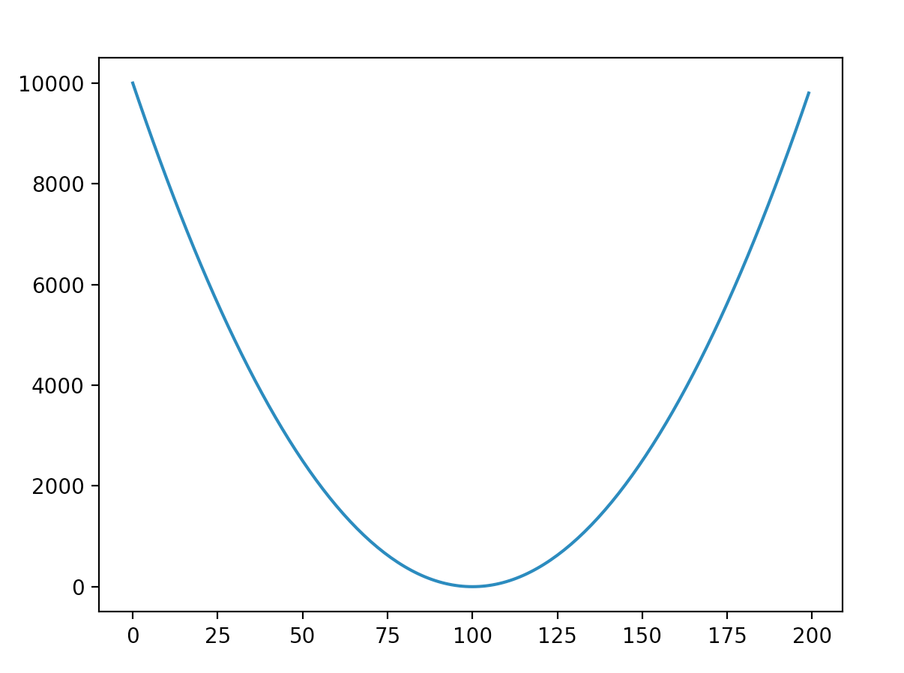
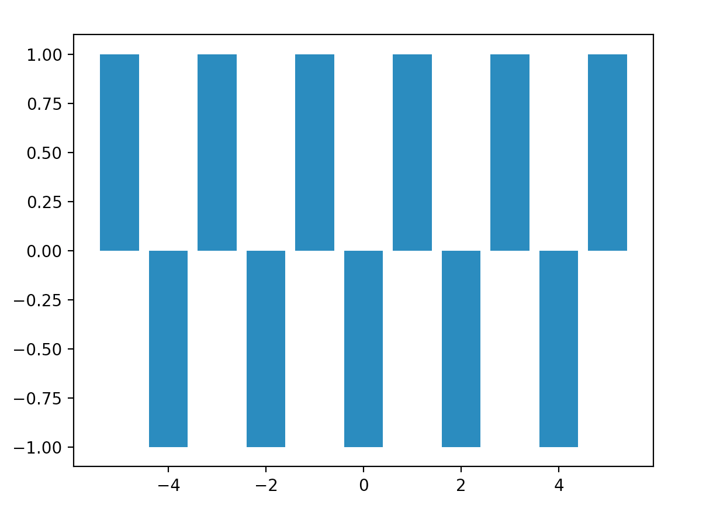
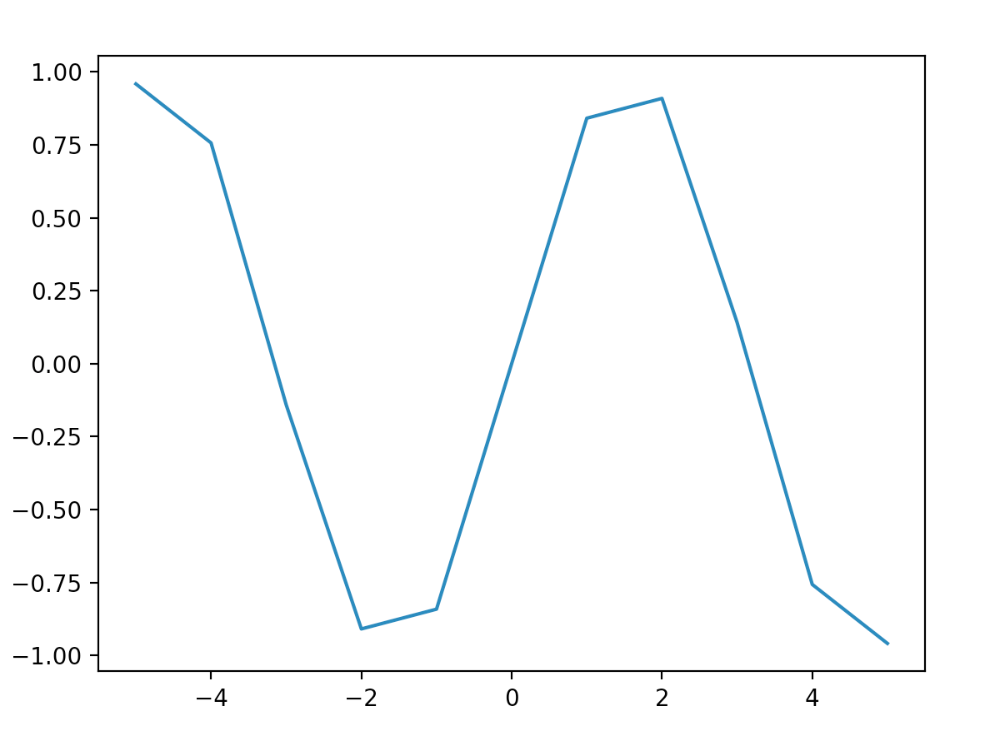
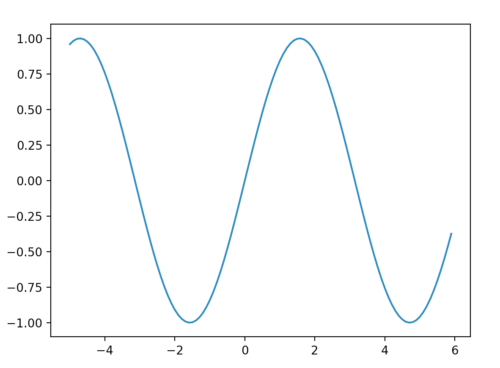

# Function Exercises

### 1. Hello

Write a function hello which takes a name parameter and says Hello to the name. Example: hello('Igor') should print
```
Hello Igor
```
to the terminal.

### 2. y = x + 1

Write a function f(x) that returns x + 1 and plot it for x values of -3 to 3 in increments of 1. You may use the following code template:
```
import matplotlib.pyplot as plot

def f(x):
    # put your code here

xs = list(range(-3, 4))
ys = []
for x in xs:
    ys.append(f(x))

plot.plot(xs, ys)
plot.show()
```
It should look like this


### 3. Square of x

Write a function f(x) that returns that square of x. Plot it for x values of -100 to 100 in increments of 1. It should look like this



### 4. Odd or Even

Write a function f(x) that returns 1 if x is odd and -1 if x is even. Plot it for x values of -5 to 5 in increments of 1. This time, instead of using plot.plot, use plot.bar instead to make a bar graph. It should look like this



### 5. Sine

Write a function f(x) that returns the sin of x. Hint: there is a sin function in the math module. Plot it from -5 to 5 in increments of 1. It should look like this Sin 1



### 6. Sine 2

Unfortunately, that looked horrible, and we can't use smaller increment values because the range function only supports integers. Fortunately, there is a Python package called numpy that will allow ranges with decimal-point increments. You will install it using the command pip install numpy. Once you've done that, you write the import statement: from numpy import arange, and then you can use arange in place of range to use decimal increments, like so:

xs = arange(-5, 6, 0.1)
Now plot the graph from -5 to -5 in 0.1 increments, and you should see this



### 7. Degree Conversion

Write a function that takes a temperature in Celsius and converts it Fahrenheit. Plot it on a graph.

### 8. Play again?

Write a function that prompts the user for input, asking them "Do you want to play again (Y on N)?". If the user answers "Y", the function should return True, otherwise, it should return False.

### 9. Play again? Again.

Write a function that asks the user whether they want to play again last the previous problem. Except this time, they have to answer with either "Y" or "N", if they give an invalid input, it should say "Invalid input." and prompt the user again for an answer. When the user finally gives a valid input, the function will return True if it was "Y", and False if it was "N".
