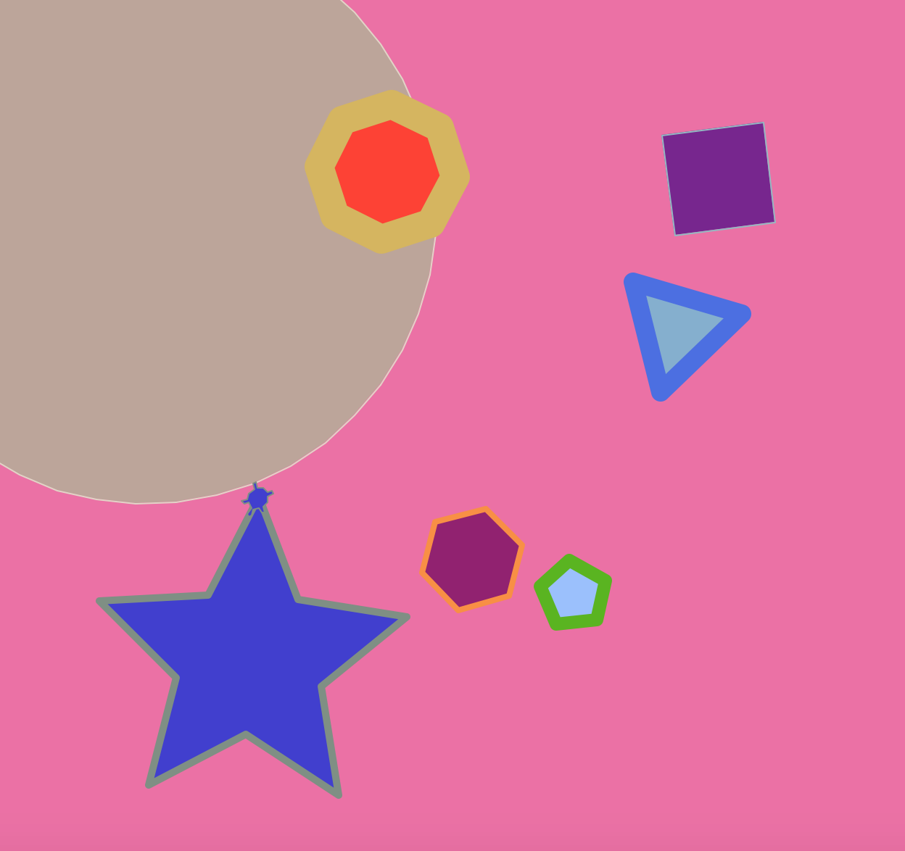

# Turtle Exercises

### Prerequisites

Install [Python](https://www.python.org/downloads/)

### Getting Started

1. In terminal, clone repository:
`git clone https://github.com/egarcia410/digitalCraft.git`

2. Change directory:
`cd /digitalcraft/week1/9-turtleExercises`

3. Run program:
`python3 index.py`

### Exercise 0

Follow the code exercise in the lecture/slides and make it run.

### Exercise 1

Draw these simple shapes (each in its own .py file):

1. an equilateral triangle
2. a square
3. a pentagon
4. a hexagon
5. an octagon
6. a star
7. a circle
### Exercise 2

Extract all the code for the shapes in exercise 1 into functions. Move them all
into a single file called `shapes.py`. Write a new .py program that imports the
shapes module and use its functions to draw all the available shapes onto the screen.

### Exercise 3

Add parameters into the various functions of your shapes module. Include:

1. size - the size of the shape
2. fill - a bool specifying whether to fill or outline the shape
3. color - the color of the shape.

*Hint: you can use the color function to set both the pen color and the fill color.

4. Make a new .py program that imports the shapes module and uses its functions to draw different shapes of various colors, fills, and sizes.

### Exercise 4

Draw a night sky full of stars of various sizes. *Hint: use bgcolor function to set the background color.

### Artistic Project 1

Draw your own house, be detailed. Break down the components of the house such as door, window, roof, porch, etc into individual functions.

### or Artistic Project 2

Draw an abstract design inspired by the artwork around the room. Use functions to break down the design into several components.

### or Artistic Project 3

Recreate the DigitalCrafts logo. Use functions to break down the design into several components.

