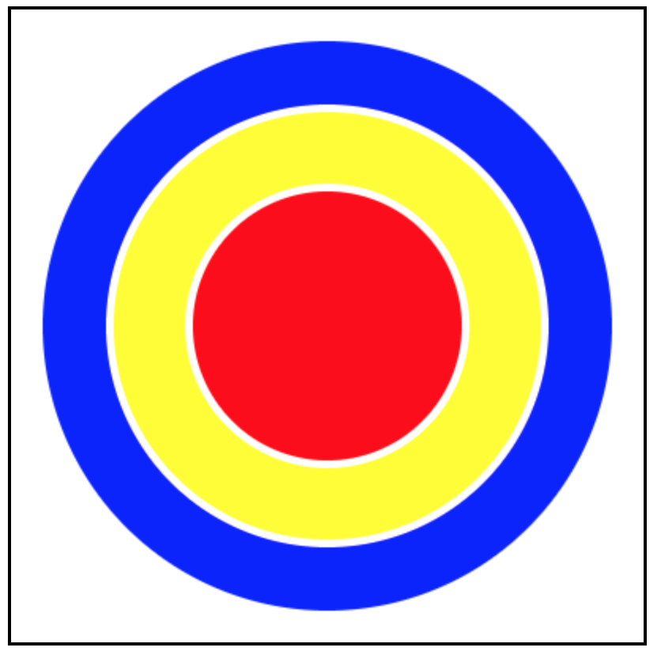

# Canvas Exercise

## Getting Started

1. Install [Node.js](https://nodejs.org/en/download/)

2. Clone Repository:

        $ git clone https://github.com/egarcia410/digitalCraft.git

3. Change Directory:

        $ cd digitalCraft/Week9/canvasExercise

4. Install Dependencies:

        $ npm install

5. Run Program:

        $ node server.js
    
    or for automatic restarting of application:

        $ nodemon server.js

